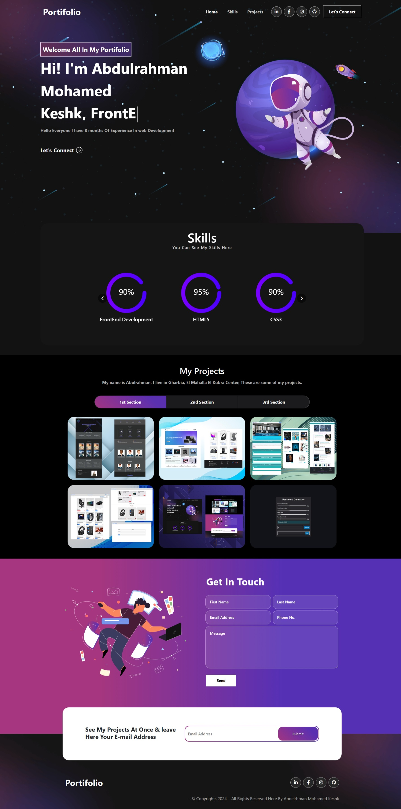

# React Portfolio Practice Project 🚀

A React.js learning project - **This is NOT my official portfolio**, but rather a practice application to learn and demonstrate React.js development skills. This project serves primarily as a learning exercise and technical demonstration.

## ⚠️ IMPORTANT DISCLAIMER

**DO NOT USE OR MODIFY THIS PROJECT** - This repository contains personal information and is shared for educational purposes only to demonstrate React.js skills. It is not intended for reuse, modification, or as a template for others.

## 🌟 Live Demo

**[View Live Portfolio](https://abdelrhman-keshk.github.io/Portifolio-App/)**

## 📸 Preview

 <!-- Add a screenshot of your portfolio -->

## 🎯 Project Purpose

This project was created as a **learning exercise** to practice and demonstrate:
- React.js fundamentals and component architecture
- Modern JavaScript (ES6+) features
- Responsive web design principles
- CSS styling and animations
- Git version control and GitHub Pages deployment

**⚠️ Important Note:** This is a practice project for learning React, not my official professional portfolio. The primary purpose is educational and skill development.

## ✨ Learning Features Implemented

- **Responsive Design** - Optimized for all devices (desktop, tablet, mobile)
- **Modern UI/UX** - Clean and professional interface
- **Interactive Animations** - Smooth transitions and engaging user experience
- **Projects Showcase** - Detailed presentation of work and accomplishments
- **Skills Section** - Visual representation of technical expertise
- **Contact Form** - Communication interface
- **Fast Loading** - Optimized performance and loading times

## 🛠️ Built With

- **React.js** - Frontend library (main learning focus)
- **HTML5** - Markup language
- **CSS3** - Styling and animations
- **JavaScript (ES6+)** - Programming language
- **GitHub Pages** - Deployment platform
- **Git** - Version control

## 🎓 What I Learned

Through building this React practice project, I gained experience with:

- **Component-Based Architecture** - Breaking down UI into reusable components
- **JSX Syntax** - Writing HTML-like syntax within JavaScript
- **State Management** - Using React hooks (useState, useEffect)
- **Props Handling** - Passing data between components
- **Event Handling** - Managing user interactions
- **Responsive Design** - Creating mobile-friendly interfaces
- **Deployment** - Publishing React apps to GitHub Pages
- **Project Structure** - Organizing a React application effectively

## 📁 Project Structure

```
Portifolio-App/
├── public/
│   ├── index.html
│   └── favicon.ico
├── src/
│   ├── components/
│   │   ├── Header/
│   │   ├── About/
│   │   ├── Projects/
│   │   ├── Skills/
│   │   └── Contact/
│   ├── assets/
│   │   ├── images/
│   │   └── icons/
│   ├── styles/
│   │   └── *.css
│   ├── App.js
│   └── index.js
├── package.json
└── README.md
```

## 📱 Responsive Design Testing

This portfolio was tested on:
- ✅ Desktop (1920px+)
- ✅ Laptop (1024px - 1919px)
- ✅ Tablet (768px - 1023px)
- ✅ Mobile (320px - 767px)

## 🚀 Deployment Process

This project is deployed using GitHub Pages:

1. **Build the project**
   ```bash
   npm run build
   ```

2. **Deploy to GitHub Pages**
   ```bash
   npm run deploy
   ```

## 🔮 Learning Goals & Next Steps

Future learning objectives for React development:
- [ ] Learn React Router for multi-page applications
- [ ] Practice with React Context API for state management
- [ ] Implement React testing with Jest and React Testing Library
- [ ] Explore React performance optimization techniques
- [ ] Learn integration with backend APIs
- [ ] Practice with React frameworks like Next.js

## 📝 License

This project is for educational purposes only and contains personal information. **Please do not use, modify, or distribute this code.**

## 👤 Author

**Abdelrhman Keshk** - React Learning Journey

- GitHub: [@abdelrhman-keshk](https://github.com/abdelrhman-keshk)
- Practice Project: [https://abdelrhman-keshk.github.io/Portifolio-App/](https://abdelrhman-keshk.github.io/Portifolio-App/)

*Note: This is a learning project, not my official portfolio*

## 🙏 Acknowledgments

- Thanks to the React.js community for excellent documentation and learning resources
- Inspiration from various portfolio designs for practicing UI development
- Online tutorials and courses that helped in learning React fundamentals

---

⭐ **If this learning project helped you understand React concepts, feel free to star it for reference!**

**Disclaimer:** This is a practice project for learning React.js, not an official portfolio. Contains personal information - do not use or modify.
